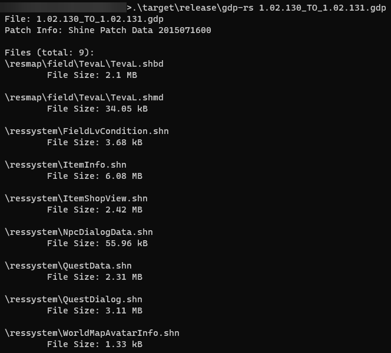

# gdp-rs
A simple utility to extract data from GDP files. These are used on Gamigo games patchers to update the game.



# Extracting
A GDP file can be extracted with the following command:

```bash
./gdp-rs <path_to_gdp_file>
```

This will extract the data contained within the patch data to the current working directory.

# Building
An installation of Cargo and Rust is required to build this project.

Simply run the following command to build the project:
```bash
cargo build [optional: --release]
```